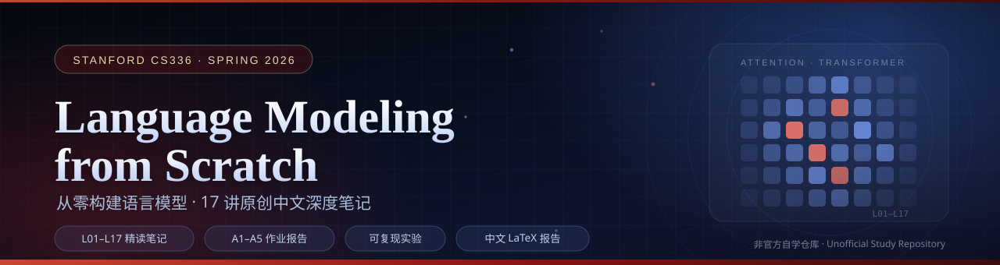

<p align="center">
  
</p>

# Stanford CS336: Language Modeling from Scratch

这是一个面向自学者的非官方学习仓库，围绕 Stanford CS336 记录从零构建语言模型的笔记、作业实现、实验和复盘。仓库同时保留 Spring 2025 与 Spring 2026 的官方作业骨架，便于比较课程演进；所有个人实现都会注明对应版本。

> 本项目与 Stanford University、课程教师及助教团队无隶属关系。官方材料版权与许可归原作者所有。

## 学习路线

| 阶段 | 主题 | 主要产出 |
| --- | --- | --- |
| 1 | Basics | BPE、Transformer、AdamW、训练与生成 |
| 2 | Systems | Profiling、Triton FlashAttention、分布式训练 |
| 3 | Scaling | Scaling laws、实验设计与外推 |
| 4 | Data | Common Crawl、过滤、去重与数据配比 |
| 5 | Alignment | SFT、DPO、GRPO 与推理训练 |

## 仓库结构

```text
assignments/
  spring2025/        # 官方 2025 作业快照，随后完成个人实现
  spring2026/        # 官方 2026 作业快照，随后完成个人实现
notes/               # 按讲次整理的原创中文笔记
experiments/         # 可复现实验记录（不提交数据和权重）
resources/           # 官方与第三方精选资料索引
scripts/             # 上游同步与仓库检查脚本
templates/           # 笔记、作业和实验记录模板
UPSTREAM.md          # 官方快照的来源、分支和 commit
```

## 开始学习

1. 阅读 [`resources/official.md`](resources/official.md) 并选择课程版本。
2. 用 [`resources/2025-vs-2026.md`](resources/2025-vs-2026.md) 确认版本差异，避免混用接口。
3. 复制 [`templates/lecture-note.md`](templates/lecture-note.md) 开始写讲义笔记。
4. 在对应作业目录中实现代码，并按 [`templates/assignment-writeup.md`](templates/assignment-writeup.md) 记录设计与结果。
5. 数据集、模型权重和密钥只保存在本地；下载方式见各官方作业 README。

Spring 2026 全部 17 讲原创中文自学笔记见
[`notes/README.md`](notes/README.md)，并提供
[`术语表`](notes/GLOSSARY.md) 与 [`复习路线`](notes/READING-ROADMAP.md)。

系统化的官方题目索引、论文/工具导读、社区资料评估和可复现实验卡片见
[`experiments/README.md`](experiments/README.md)。该资料库采用 official-first 与
spoiler 分级，并在 [`experiments/SOURCES.yaml`](experiments/SOURCES.yaml) 记录来源和许可。

## 进度

- [x] [Assignment 1 — Basics](assignments/spring2026/assignment1-basics/)：75 runs、27 图、BPE/Transformer/训练实验
- [x] [Assignment 2 — Systems](assignments/spring2026/assignment2-systems/)：fused FlashAttention、DDP/FSDP、228 条性能记录
- [x] [Assignment 3 — Scaling](assignments/spring2026/assignment3-scaling/)：官方 IsoFLOPs + 22-run RTX proxy
- [x] [Assignment 4 — Data](assignments/spring2026/assignment4-data/)：21/21 tests、真实 WET 过滤/去重分析
- [x] [Assignment 5 — Alignment](assignments/spring2026/assignment5-alignment/)：GRPO/DPO/SFT 接口与 4480-row proxy

详细进度见 [`PROGRESS.md`](PROGRESS.md)。

## 硬件提示

Assignment 1 的小规模实验可在消费级 GPU 或 CPU 上运行；Assignment 2 的 Triton/CUDA 部分需要 NVIDIA GPU；Assignment 4 和 5 的完整实验通常需要多卡或云算力。仓库会优先提供小规模、可复现的替代实验，并明确它们与课程正式配置的差异。

五份作业均包含中文 LaTeX 报告、自动生成图片、原始指标、summary 与 SHA-256 manifest。
资源受限的官方环境（2×B200、8×B200、Modal/SUNET）均使用明确标注的单卡或离线 proxy，
不会冒充 leaderboard 结果。

报告入口：

- [A1 report](assignments/spring2026/assignment1-basics/report/main.pdf)
- [A2 report](assignments/spring2026/assignment2-systems/report/writeup.pdf)
- [A3 report](assignments/spring2026/assignment3-scaling/report/writeup.pdf)
- [A4 report](assignments/spring2026/assignment4-data/report/writeup.pdf)
- [A5 report](assignments/spring2026/assignment5-alignment/report/writeup.pdf)

## 引用与学术诚信

- 官方模板按其原始许可证保留版权说明，来源固定记录在 [`UPSTREAM.md`](UPSTREAM.md)。
- 第三方笔记和实现只在 `resources/` 中链接，不复制其内容。
- 先独立实现和记录失败过程，再查看参考答案；引用任何思路时在 writeup 中注明来源。
- 不将本仓库内容作为在读学生的课程提交。
- 个人实现与报告为 **AI-assisted** 学习产物；作者：
  [ShaneLiu04](https://github.com/ShaneLiu04)。

## License

本仓库原创内容采用 [MIT License](LICENSE)。导入的官方材料继续适用各自目录中的原始许可证。
