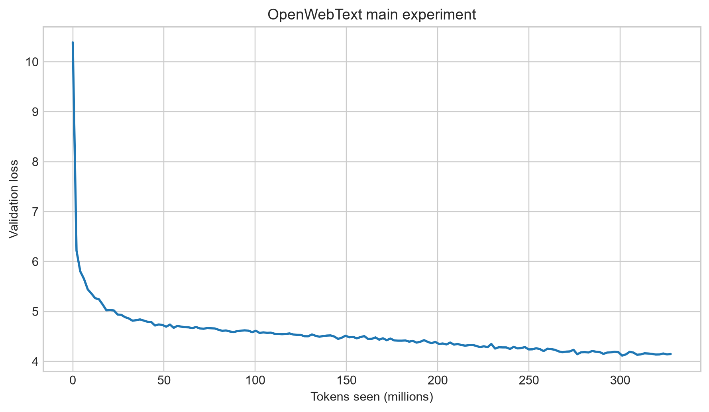
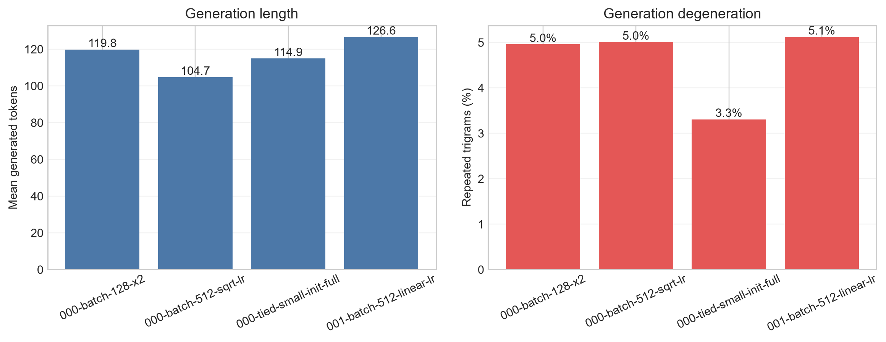
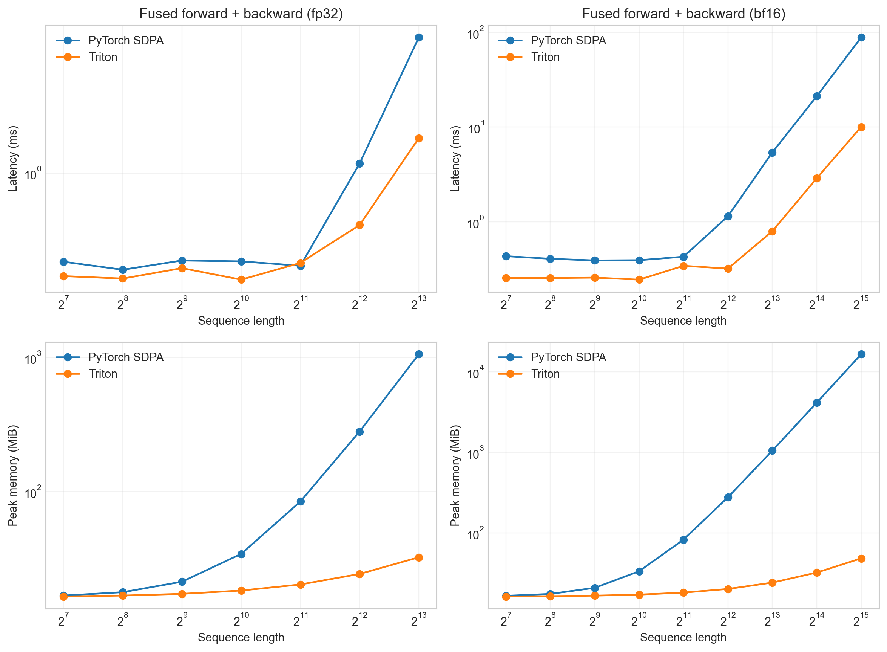
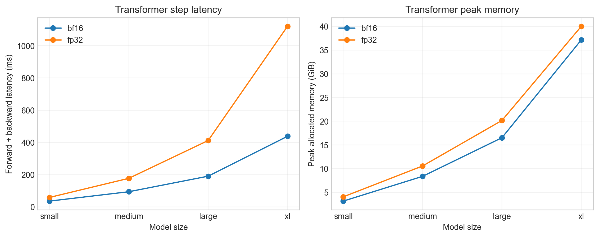
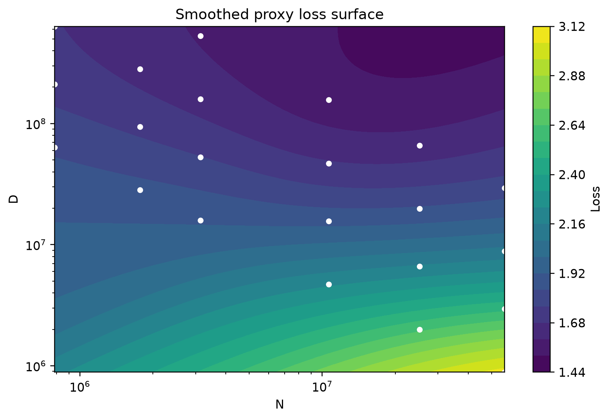
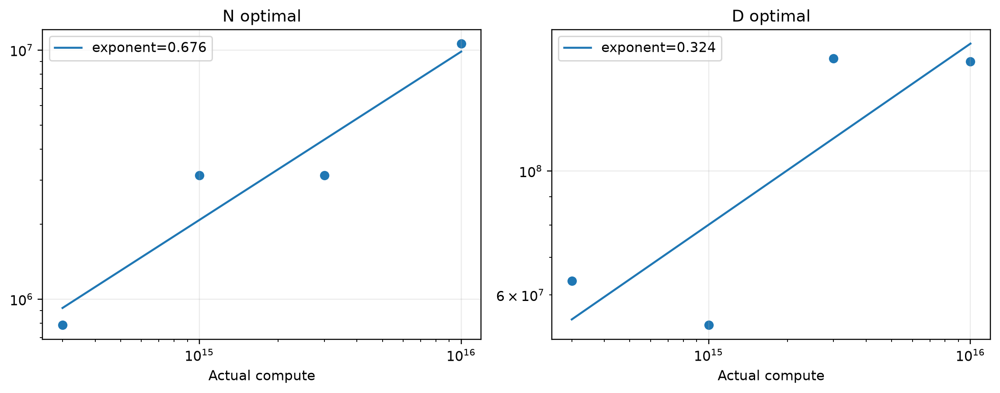
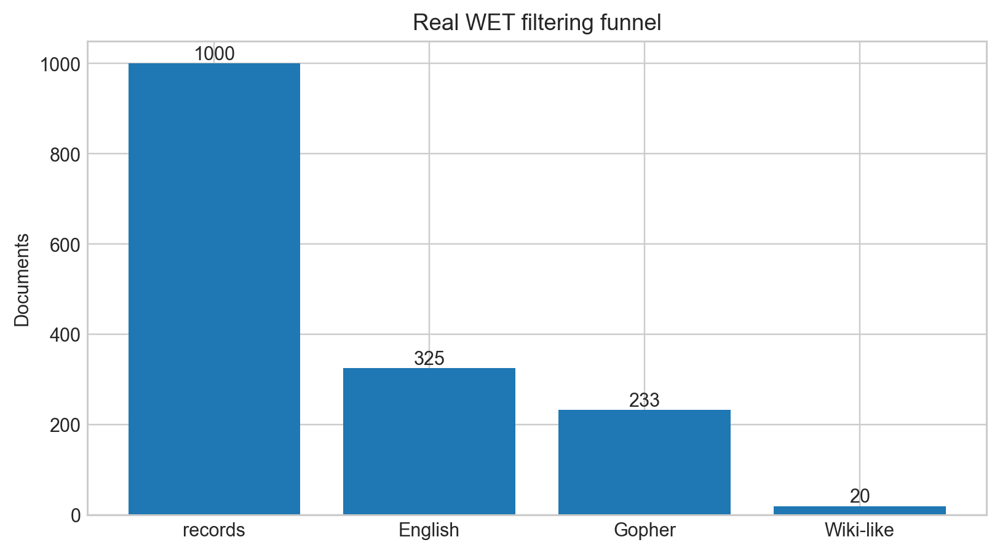
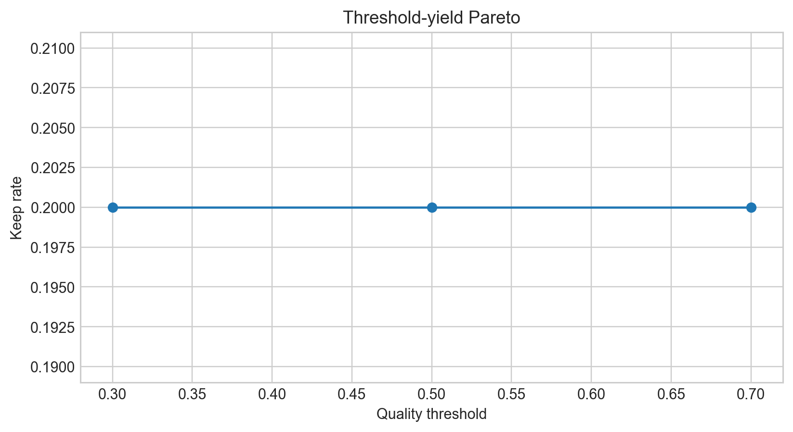
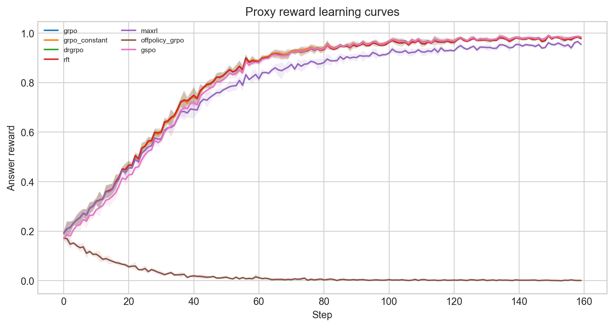
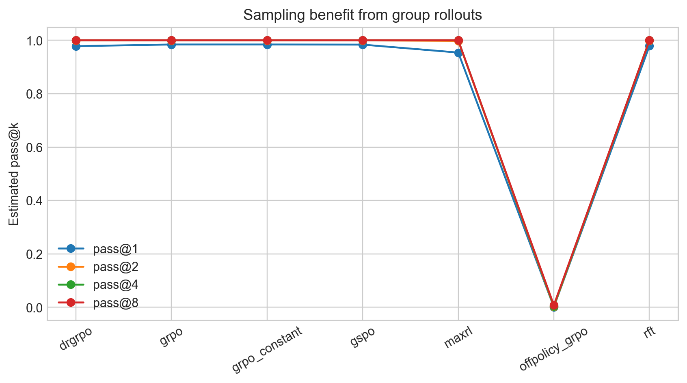

<p align="center">
  
</p>

# Stanford CS336 · Language Modeling from Scratch

> 面向面试与工程实战的语言模型系统学习仓库：围绕 Stanford CS336 完整记录「从零构建语言模型」的
> **17 讲中文笔记**、**五份作业实现**与**可复现实验**。笔记按「概念—公式—shape/复杂度—代码—实验—易错点」
> 组织，正是面试官考察深度的方式；每个知识点都可回溯到对应的实现、测试与真实指标。

> 本项目与 Stanford University 及课程团队无隶属关系。官方材料版权与许可归原作者所有。

---

## 为什么适合面试复习
大模型面试的问题很少是「背定义」，而是三类：**能推导**（FLOPs、显存、KV cache、`C≈6ND`）、
**能比较**（RMSNorm vs LayerNorm、DPO vs RLHF、DDP vs FSDP）、**能落地**（写一个 kernel、
建一条数据管线、复现一个 scaling 实验）。这套笔记对每一讲都固定产出：

- **学习目标**：面试官会问什么，这里先写清楚要能回答什么；
- **核心公式推导**：每个结论都带着假设与适用边界，而不是只给结果；
- **Shape / 复杂度速查**：模型参数、attention/FFN FLOPs、显存账本可直接手算；
- **易错点与反思**：高频追问点与常见错误，例如「为什么 loss/token 跨 tokenizer 不可比」；
- **实现映射**：每个概念对应到本仓库某一作业的代码、测试与真实实验指标；
- **面试备考四层卡**：每讲附「一页速览卡 → 高频题与答题框架 → 手撕要点 → 追问与陷阱」，可直接当最后一遍过。

复习时先看 [`notes/README.md`](notes/README.md) 的课程索引，用
[`GLOSSARY.md`](notes/GLOSSARY.md) 背术语，按 [`READING-ROADMAP.md`](notes/READING-ROADMAP.md)
排时间；面试前用下面的速查表做最后过一遍。

---

## 面试知识地图

17 讲按面试主题归为 11 大模块，每块标注对应的讲次与作业实践。

| 面试模块 | 核心考点 | 讲次 | 作业实践 |
| --- | --- | --- | --- |
| Tokenization | BPE 训练/编码、bytes/token、pre-tokenization、special token | [L1](notes/lecture-01-overview-tokenization.md) | A1 BPE |
| 计算与显存记账 | FLOPs、activation memory、arithmetic intensity、MFU | [L2](notes/lecture-02-pytorch-accounting.md) | A1 accounting |
| 模型结构 | pre-norm、RMSNorm、RoPE、SwiGLU、参数量 | [L3](notes/lecture-03-architectures-hyperparameters.md) | A1 模型/训练 |
| 注意力变体与 MoE | MQA/GQA、sparse/linear attention、MoE routing/load balancing | [L4](notes/lecture-04-attention-moe.md) | 架构扩展 |
| GPU 与 Kernel | roofline、Tensor Core、online softmax、FlashAttention | [L5](notes/lecture-05-gpus-tpus.md) [L6](notes/lecture-06-kernels-triton.md) | A2 FlashAttention |
| 分布式训练 | DDP、TP、PP、ZeRO/FSDP、通信账本 | [L7](notes/lecture-07-parallelism-percy.md) [L8](notes/lecture-08-parallelism-tatsu.md) | A2 DDP/FSDP |
| Scaling Laws | `C≈6ND`、IsoFLOP、Chinchilla vs Kaplan、外推 | [L9](notes/lecture-09-scaling-laws-i.md) [L11](notes/lecture-11-scaling-laws-ii.md) | A3 IsoFLOP |
| 推理与评估 | prefill/decode、KV cache、speculative decoding、contamination | [L10](notes/lecture-10-inference.md) [L12](notes/lecture-12-evaluation.md) | A3/A5 评测 |
| 数据工程 | Common Crawl、过滤、MinHash/LSH 去重、数据配比 | [L13](notes/lecture-13-data-sources.md) [L14](notes/lecture-14-data-filtering-dedup.md) | A4 过滤/去重 |
| 对齐与 RL | SFT、RLHF、DPO、GRPO 系列、RLVR | [L15](notes/lecture-15-sft-rlhf.md) [L16](notes/lecture-16-rlvr.md) | A5 GRPO |
| 多模态 | ViT patch、CLIP InfoNCE、projector / Q-Former / cross-attention、三阶段对齐、幻觉诊断 | [L17](notes/lecture-17-multimodal-alignment.md) | 扩展 |

---

## 高频面试题速查

> 每题给出「一句话答案要点」与对应笔记；细节推导见笔记正文。适合面试前逐条过一遍。

### 模型结构与训练（L1–L4）

| 问题 | 答案要点 | 笔记 |
| --- | --- | --- |
| BPE 训练与编码为什么是两个过程？ | 训练是统计 pair 频率迭代合并（得到 merge rank）；编码是按 merge rank 贪心合并，不重复统计 | [L1](notes/lecture-01-overview-tokenization.md) |
| 为什么 loss/token 跨 tokenizer 不可比？ | token 是人为构造单位；应换算成 `nats/byte` 或用压缩率归一 | [L1](notes/lecture-01-overview-tokenization.md) |
| pre-tokenization 有什么用？ | 在 BPE 前按边界拆分，防止跨不合理边界（如跨词、跨符号）合并 | [L1](notes/lecture-01-overview-tokenization.md) |
| RMSNorm 与 LayerNorm 的区别？ | RMSNorm 用 root-mean-square 缩放、不减均值、不加 bias，省一次中心化计算 | [L3](notes/lecture-03-architectures-hyperparameters.md) |
| 为什么 pre-norm 比 post-norm 好训练？ | pre-norm 让残差路径保持单位尺度，改善初始化梯度，深层更稳定 | [L3](notes/lecture-03-architectures-hyperparameters.md) |
| RoPE 如何编码相对位置？优势？ | 用位置相关的二维旋转作用于 Q/K，使点积只依赖相对位置；比绝对位置编码支持更长的外推 | [L3](notes/lecture-03-architectures-hyperparameters.md) |
| SwiGLU 为什么优于 ReLU/GELU？ | gated 结构 `SiLU(W₁x)⊙W₃x` 表达更强；需按 `d_ff` 匹配参数量做公平比较 | [L3](notes/lecture-03-architectures-hyperparameters.md) |
| 参数量怎么手算？ | 单层 ≈ `12 d²`（QKV+out 4d² + FFN 8d²），总 `12 L d²`（d_ff=4d 时） | [L2](notes/lecture-02-pytorch-accounting.md) |
| MQA / GQA 解决了什么？ | 减少 KV head 数，压缩 KV cache 显存与带宽；GQA 是 MHA 与 MQA 的折中 | [L4](notes/lecture-04-attention-moe.md) |
| MoE 怎么做 load balancing？ | auxiliary loss 惩罚 token 分布不均；细粒度 expert、shared expert、dropless routing 缓解 collapse | [L4](notes/lecture-04-attention-moe.md) |

### 系统、GPU 与分布式（L2、L5–L8）

| 问题 | 答案要点 | 笔记 |
| --- | --- | --- |
| `C≈6ND` 怎么推导？ | forward 约 `2ND`、backward 约 `4ND`，合计 `6ND` FLOPs（忽略非 matmul） | [L2](notes/lecture-02-pytorch-accounting.md) |
| arithmetic intensity 与 roofline？ | `FLOPs/bytes`；算力比 > 峰值算力/带宽则 compute-bound，否则 memory-bound | [L2](notes/lecture-02-pytorch-accounting.md) |
| 为什么 attention 是 memory-bound、GEMM 是 compute-bound？ | attention 的 arithmetic intensity 随序列长度下降，受带宽限制 | [L5](notes/lecture-05-gpus-tpus.md) |
| FlashAttention 为什么快？ | 分块 tiling + online softmax，避免把 `T²` 的 attention 矩阵写回 HBM | [L6](notes/lecture-06-kernels-triton.md) |
| online softmax 解决什么？ | 分块更新 row max 与归一化分母，无需先扫一遍求全局 max | [L6](notes/lecture-06-kernels-triton.md) |
| DDP 的梯度同步怎么做？ | backward 后 all-reduce 平均梯度；bucketed 按 bucket 触发，与 backward 重叠 | [L7](notes/lecture-07-parallelism-percy.md) |
| ZeRO 三阶段分别分片什么？ | 1) optimizer state 2) + gradient 3) + parameter | [L8](notes/lecture-08-parallelism-tatsu.md) |
| TP 与 PP 的通信/缺陷？ | TP 切权重、每步多次 all-reduce；PP 切层、有 bubble，1F1B 减少 bubble | [L8](notes/lecture-08-parallelism-tatsu.md) |
| DDP vs FSDP 何时选？ | 单卡放得下用 DDP；显存紧张、需更大模型时用 FSDP 换通信 | [L8](notes/lecture-08-parallelism-tatsu.md) |

### Scaling、推理与评估（L9–L12）

| 问题 | 答案要点 | 笔记 |
| --- | --- | --- |
| Chinchilla 与 Kaplan 的分歧？ | Kaplan 倾向更大模型更少数据；Chinchilla 用密集 IsoFLOP 认为参数与 token 近似等比例增长 | [L9](notes/lecture-09-scaling-laws-i.md) |
| IsoFLOP 是什么？ | 固定 `C`，扫描不同 `(N,D)` 找最低 loss，形成 compute-optimal envelope | [L9](notes/lecture-09-scaling-laws-i.md) |
| 幂律指数是自然常数吗？ | 否，是特定架构/数据/优化器/规模区间下的经验参数 | [L11](notes/lecture-11-scaling-laws-ii.md) |
| prefill 与 decode 的区别？ | prefill 一次算全部 prompt（compute-bound）；decode 逐 token（memory-bound，受 KV cache 带宽限制） | [L10](notes/lecture-10-inference.md) |
| KV cache 显存怎么算？ | `2 × L × T × n_kv_heads × d_head × bytes` | [L10](notes/lecture-10-inference.md) |
| continuous batching / paged attention？ | 动态合并不同到达/结束的请求；把 KV cache 按页管理减少碎片 | [L10](notes/lecture-10-inference.md) |
| speculative decoding 的思路？ | draft model 提议多个 token，target model 并行验证，接受正确的并回退 | [L10](notes/lecture-10-inference.md) |
| perplexity 与 bits-per-byte？ | perplexity 是 token-level 指数 loss；bits-per-byte 用压缩率归一，跨 tokenizer 可比 | [L12](notes/lecture-12-evaluation.md) |
| contamination 的影响？ | 训练集混入 benchmark 使评估虚高，需去重与溯源 | [L12](notes/lecture-12-evaluation.md) |

### 数据与对齐（L13–L16）

| 问题 | 答案要点 | 笔记 |
| --- | --- | --- |
| Common Crawl → 高质量语料的管线？ | 抓取 → 语言/质量/安全过滤 → 去重（exact + MinHash）→ 数据配比 | [L13](notes/lecture-13-data-sources.md) [L14](notes/lecture-14-data-filtering-dedup.md) |
| MinHash + LSH 去重原理？ | MinHash 近似 Jaccard；LSH 分 band 找候选对，避免 `O(n²)` | [L14](notes/lecture-14-data-filtering-dedup.md) |
| DSIR / DoReMi 做什么？ | 用 density ratio / 学习到的 domain weights 调整数据配比 | [L14](notes/lecture-14-data-filtering-dedup.md) |
| RLHF 与 DPO 的关系？ | RLHF 先训 reward model 再 PPO；DPO 直接优化 chosen/rejected 相对 reference 的偏好，免 reward model | [L15](notes/lecture-15-sft-rlhf.md) |
| reward hacking 是什么？ | policy 优化 proxy reward 而非真实目标；需 KL 正则、多维度 reward 缓解 | [L15](notes/lecture-15-sft-rlhf.md) |
| GRPO 相比 PPO 的区别？ | 去掉 value/critic，用同 prompt 一组 rollout 的相对 reward 构造 advantage | [L16](notes/lecture-16-rlvr.md) |
| Dr.GRPO / RFT / MaxRL 的差别？ | 不同 baseline 与 normalization（去 bias、positive-only、mean baseline） | [L16](notes/lecture-16-rlvr.md) |
| GSPO 解决什么？ | token 级 ratio 在长序列上方差过大，改用 response 内平均 log-ratio 的序列级 ratio 并 clip | [L16](notes/lecture-16-rlvr.md) |
| outcome vs process verifier？ | outcome 只看最终产物、鲁棒但信号稀疏；process 逐步打分、信号密集但需步级标注 | [L16](notes/lecture-16-rlvr.md) |
| alignment tax 是什么？ | 对齐后基础能力或某些 benchmark 下降的代价 | [GLOSSARY](notes/GLOSSARY.md) |

### 多模态（L17）

| 问题 | 答案要点 | 笔记 |
| --- | --- | --- |
| 三种连接结构怎么选？ | linear projector 最简（LLaVA）；Q-Former/resampler 用 learned queries 压缩；cross-attention 按需读视觉（Flamingo）；VQ 统一 token 支持生成 | [L17](notes/lecture-17-multimodal-alignment.md) |
| 视觉 token 数怎么算？ | `N_img=(H/P)(W/P)`，随分辨率二次增长；全拼接 attention 为 `O((N_text+N_img)²)` | [L17](notes/lecture-17-multimodal-alignment.md) |
| CLIP 的 InfoNCE 做什么？ | batch 内对比学习，让匹配 image-text 相似度高于负对，建立可迁移的对齐表示空间 | [L17](notes/lecture-17-multimodal-alignment.md) |
| 多模态对齐分几阶段？ | 表示对齐（caption/InfoNCE）→ 指令微调（response-only）→ 偏好与安全对齐 | [L17](notes/lecture-17-multimodal-alignment.md) |
| Flamingo 的 gate 为什么接近零初始化？ | gated cross-attention 从零开始，避免接入新模态破坏原语言能力 | [L17](notes/lecture-17-multimodal-alignment.md) |
| 多模态幻觉怎么诊断？ | 用 counterfactual image pairs、遮挡、属性交换验证输出随证据变化，而非「回答合理」 | [L17](notes/lecture-17-multimodal-alignment.md) |
| 图内 prompt injection 怎么防？ | 图中 OCR 文本是不可信数据，需显式建模系统/用户/图像三级信任边界 | [L17](notes/lecture-17-multimodal-alignment.md) |

---

## 公式与复杂度速查表

面试常要求**现场手推**，这些是必须能默写的量（符号见 [GLOSSARY](notes/GLOSSARY.md)）。

| 量 | 公式 / 数量级 | 说明 |
| --- | --- | --- |
| 训练 FLOPs | `C ≈ 6 N D` | forward `2ND` + backward `4ND` |
| 模型参数量 | `≈ 12 L d²`（`d_ff=4d`） | 单层 QKV+out `4d²` + FFN `8d²` |
| attention 计算 | `O(T² d)` 每头、`O(B T² d)` 每层 | score 矩阵 `T²` 是瓶颈 |
| FFN 计算 | `8 B T d²`（`d_ff=4d`） | 大 `d` 时主导训练 FLOPs |
| activation 显存 | 随 batch、序列、层数线性增长 | checkpointing 用重算换显存 |
| KV cache / token | `2 × L × n_kv_heads × d_head × bytes` | BF16 时 `bytes=2` |
| arithmetic intensity | `FLOPs / bytes` | 与峰值算力/带宽比较定 bound |
| MFU | 实测 FLOPs / 硬件峰值 FLOPs | 衡量 GPU 利用率 |
| 视觉 patch 数 | `N_img = (H/P)(W/P)` | 随分辨率二次增长 |
| 多模态 attention 成本 | 全拼接 `O((N_text+N_img)²)`，cross-attention `O(N_text·N_img)` | projector 与 cross-attention 的取舍 |

完整推导与边界条件见 [L2](notes/lecture-02-pytorch-accounting.md)（FLOPs/显存）、
[L3](notes/lecture-03-architectures-hyperparameters.md)（参数量）、
[L9](notes/lecture-09-scaling-laws-i.md)（`C≈6ND`）、
[L10](notes/lecture-10-inference.md)（KV cache）、
[L17](notes/lecture-17-multimodal-alignment.md)（视觉 token 成本）。

---

## 学习路线

| 阶段 | 主题 | 主要产出 | 面试关联 |
| --- | --- | --- | --- |
| 1 | Basics | BPE、Transformer、AdamW、训练与生成 | Tokenization + 模型结构 + 记账 |
| 2 | Systems | Profiling、Triton FlashAttention、分布式训练 | GPU/kernel + 分布式 |
| 3 | Scaling | Scaling laws、实验设计与外推 | Scaling + 推理 |
| 4 | Data | Common Crawl、过滤、去重与配比 | 数据工程 |
| 5 | Alignment | SFT、DPO、GRPO 与推理训练 | 对齐/RL |

---

## 复习路线

详见 [`READING-ROADMAP.md`](notes/READING-ROADMAP.md)。速览版（面试前 2 小时）：

1. [L1](notes/lecture-01-overview-tokenization.md) tokenization 全流程与 `nats/byte`；
2. [L3](notes/lecture-03-architectures-hyperparameters.md) 现代 Transformer block 与参数量；
3. [L6](notes/lecture-06-kernels-triton.md) FlashAttention 为什么减少 IO；
4. [L9](notes/lecture-09-scaling-laws-i.md) `C≈6ND` 与 compute-optimal；
5. [L14](notes/lecture-14-data-filtering-dedup.md) 过滤+去重流水线；
6. [L16](notes/lecture-16-rlvr.md) GRPO 与 verifiable reward；
7. [L17](notes/lecture-17-multimodal-alignment.md) 三种连接结构与幻觉诊断（时间允许时）。

每讲复习闭环（来自 [READING-ROADMAP](notes/READING-ROADMAP.md)）：不看笔记写 5 个关键词 → 手推一个公式 →
写关键 shape/通信量 → 在本仓库找一个测试/图验证 → 给一个反例/失效边界。

---

## 作业成果概览

### A1 · Basics — 从字节级 BPE 到 Transformer 训练闭环

75 个可复现训练 run、27 组图表，覆盖 RTX 4080 SUPER / RTX 6000D 两代硬件。
TinyStories 上三个 batch-32 种子达到最优验证 loss **1.371 ± 0.002**，batch 256 到 **1.325**。



架构消融：NoPE 退化到 **1.439**、post-norm 到 **1.385**，SiLU FFN 与 SwiGLU 接近；移除 RMSNorm
即使跑满 327.68M token 仍不稳定（最优 loss **7.512**）。tied embeddings 把 32K 词表模型从 45.22M 参数
降到 28.84M，并把 OWT 最优 loss 从 4.116 压到 **4.097**。



### A2 · Systems — Triton FlashAttention 与分布式训练

228 条性能记录、256 条数值误差、12 条 checkpointing。自写 Triton kernel 在 `N=8192, d=64` 的 BF16
forward 上达到 **0.307 ms**（对比 SDPA 3.122 ms，10.17×），峰值显存 12.16 MiB vs 853.13 MiB（70.2×）。



`N=32768, d=64` fused forward+backward：Triton 10.06 ms（8.80×），峰值显存 48.5 MiB vs 16,444 MiB（**339×**）。
activation checkpointing 把 large 模型峰值显存从 56.48 GiB 降到 11.53 GiB。



### A3 · Scaling — IsoFLOP 拟合与联合 scaling law

官方 IsoFLOP 分析（72 条记录、9 个计算档位）+ 22-run RTX 6000D TinyStories proxy，
完成幂律拟合、bootstrap 不确定性与外推敏感性分析。





### A4 · Data — Common Crawl 过滤与去重

21/21 公开测试通过。离线报告基于 400 篇受控文档、1000 条官方 sample WET records 与 12 组过滤消融，
覆盖 HTML 提取、语言识别、PII 掩码、NSFW/toxicity、Gopher 质量与 MinHash 去重。





### A5 · Alignment — GRPO 系列推理训练

主作业 + supplement 共 26/26 tests 通过。实现 GRPO / Dr.GRPO / MaxRL / RFT、off-policy GRPO / GSPO、
SFT packing 与 DPO，并用 RTX 6000D proxy 覆盖 7 objectives × 4 seeds × 160 steps（4480 条指标）。





---

## 实验硬件环境与限制

### 实际使用环境

| 角色 | 配置 |
| --- | --- |
| 本地开发 | Windows · Python 3.12/3.13（CPU） |
| 主力 GPU | AutoDL 云实例 · NVIDIA RTX 4080 SUPER（约 32 GB） |
| 大显存 GPU | AutoDL 云实例 · NVIDIA RTX 6000D（约 85 GB） |
| 软件栈 | PyTorch 2.8.0+cu128 · CUDA 12.8 · Triton 3.4.0 |
| 课程官方环境 | 2×B200 / 8×B200 / SUNET_ID / Modal —— **未使用** |

### 限制与取舍

1. **无 B200 与多卡 NCCL。** A2 多卡 DDP/FSDP overlap 与 2×B200 leaderboard 无法实测，报告标注「未实测」，
   不用 CPU/Gloo 或理论值冒充多卡 GPU 结果。
2. **无课程凭据。** 无 A3 API key、SUNET_ID 或 Modal 权限，A3 不调用官方 API、A4 不跑 2500-WET、
   A5 不使用官方 OLMo-2/B200。
3. **单卡是唯一 GPU。** 跨硬件绝对吞吐不可直接比较；算法结论均来自同机 controlled comparisons。
4. **Windows 缺少 `resource` 模块。** A1 两个 Linux-only 内存测试跳过（其余 23 core + 23 tokenizer 测试通过）。
5. **资源受限替代实验。** A3 用 22-run RTX 6000D proxy、A4 用 400 受控文档 + 1000 WET 样本、
   A5 用 vectorized objective proxy（4480 指标），均明确标注、不冒充 leaderboard 成绩。

一句话：**受限环境下尽量回答「方法学是否正确」，而非「绝对分数有多高」**，并明确标注不可比因素。

---

## 仓库结构

```text
assets/                 # 封面等静态资源
assignments/
  assignment1-basics/   # A1 实现 + 报告 + 75 runs + 27 图
  assignment2-systems/  # A2 实现 + 报告 + 228 性能记录
  assignment3-scaling/  # A3 实现 + 报告 + 官方 IsoFLOP + 22-run proxy
  assignment4-data/     # A4 实现 + 报告 + 21/21 tests + 过滤/去重
  assignment5-alignment/# A5 实现 + 报告 + 26/26 tests + 4480 proxy 指标
notes/                  # Spring 2026 全部 17 讲原创中文深度笔记（含必背数字/真题/系统设计/代码题）
  GLOSSARY.md           #   术语与符号速查
  READING-ROADMAP.md    #   按时间/目标/作业的复习路线
experiments/            # 官方题目索引、论文/工具导读、社区资料与实验卡片
resources/              # 官方与第三方精选资料索引
scripts/                # 上游同步与仓库检查脚本
templates/              # 笔记、作业和实验记录模板
UPSTREAM.md             # 官方快照的来源、分支和 commit
```

---

## 快速开始

1. 阅读 [`resources/official.md`](resources/official.md) 并选择课程版本。
2. 用 [`resources/2025-vs-2026.md`](resources/2025-vs-2026.md) 确认版本差异，避免混用接口。
3. 复制 [`templates/lecture-note.md`](templates/lecture-note.md) 开始写讲义笔记。
4. 在对应作业目录中实现代码，并按 [`templates/assignment-writeup.md`](templates/assignment-writeup.md) 记录设计与结果。
5. 数据集、模型权重和密钥只保存在本地；下载方式见各官方作业 README。

Spring 2026 全部 17 讲原创中文自学笔记见 [`notes/README.md`](notes/README.md)，并提供
[`术语表`](notes/GLOSSARY.md) 与 [`复习路线`](notes/READING-ROADMAP.md)。

系统化的官方题目索引、论文/工具导读、社区资料评估和可复现实验卡片见
[`experiments/README.md`](experiments/README.md)。该资料库采用 official-first 与 spoiler 分级，
并在 [`experiments/SOURCES.yaml`](experiments/SOURCES.yaml) 记录来源和许可。

---

## 进度

| 作业 | 状态 | 关键成果 |
| --- | --- | --- |
| A1 · Basics | 完成 | 75 runs、27 图、BPE/Transformer/训练实验 |
| A2 · Systems | 完成 | fused FlashAttention、DDP/FSDP、228 条性能记录 |
| A3 · Scaling | 完成 | 官方 IsoFLOPs + 22-run RTX proxy |
| A4 · Data | 完成 | 21/21 tests、真实 WET 过滤/去重分析 |
| A5 · Alignment | 完成 | GRPO/DPO/SFT 接口与 4480-row proxy |

详细进度见 [`PROGRESS.md`](PROGRESS.md)。

---

## 报告入口

| 作业 | 报告 |
| --- | --- |
| A1 · Basics | [`report/main.pdf`](assignments/assignment1-basics/report/main.pdf) |
| A2 · Systems | [`report/main.pdf`](assignments/assignment2-systems/report/main.pdf) |
| A3 · Scaling | [`report/main.pdf`](assignments/assignment3-scaling/report/main.pdf) |
| A4 · Data | [`report/main.pdf`](assignments/assignment4-data/report/main.pdf) |
| A5 · Alignment | [`report/main.pdf`](assignments/assignment5-alignment/report/main.pdf) |

---

## 引用与学术诚信

- 官方模板按其原始许可证保留版权说明，来源固定记录在 [`UPSTREAM.md`](UPSTREAM.md)。
- 第三方笔记和实现只在 `resources/` 中链接，不复制其内容。
- 先独立实现和记录失败过程，再查看参考答案；引用任何思路时在 writeup 中注明来源。
- 不将本仓库内容作为在读学生的课程提交。
- 作者： [ShaneLiu04](https://github.com/ShaneLiu04)。

---

## License

本仓库原创内容采用 [MIT License](LICENSE)。导入的官方材料继续适用各自目录中的原始许可证。
