# CS336 Spring 2026 Assignment 1: Basics

> **Independent-study implementation.** 

## Status

- Byte-level BPE and streaming tokenizer with special-token support.
- Transformer LM from scratch: RMSNorm, RoPE, causal MHA, SwiGLU, and ablation switches.
- AdamW, cosine warmup, gradient clipping, batching, checkpoints, generation, and sweeps.
- Chinese report: [`report/main.tex`](report/main.tex) and [`report/main.pdf`](report/main.pdf).

Windows verification passes 23 core/BPE tests and 23 tokenizer
correctness/parity tests; two Linux-only RSS tests are skipped. The archived
Linux record contains 47 passed and 1 xpassed.

```powershell
$env:PYTHONUTF8 = "1"
python -m uv sync
python -m uv run pytest
```

## Measured TinyStories results

The archive now contains **75 reproducible runs** across RTX 4080 SUPER and
RTX 6000D. Every figure is regenerated
from per-run config, environment, JSONL metrics, and summaries in
[`report/results/raw`](report/results/raw).

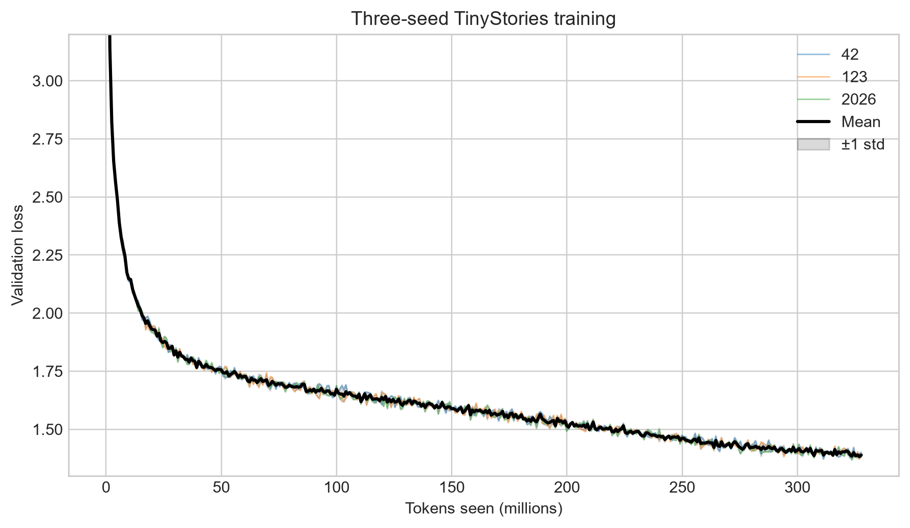

At 327.68M tokens, three batch-32 seeds reach best validation loss
**1.371 ± 0.002**. Batch 128 and 256 reach **1.331** and **1.325**.

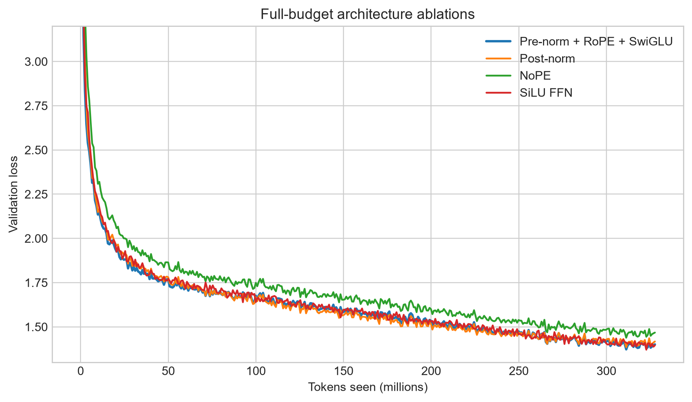

NoPE degrades to **1.439**, post-norm to **1.385**, while SiLU FFN remains
close to SwiGLU at this scale. Removing RMSNorm remains unstable even after a
full 327.68M-token run (best loss **7.512**).

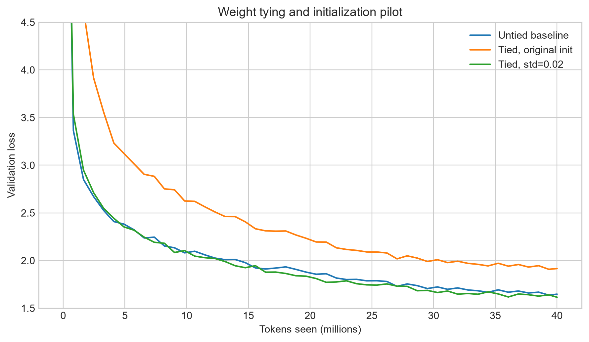

Naively tying the original std=1 embedding degrades the 40M-token loss to
**1.908**. Reinitializing the shared matrix with std=0.02 improves it to
**1.615**, versus **1.637** for the untied baseline, while reducing parameters
from 22.70M to 17.58M.

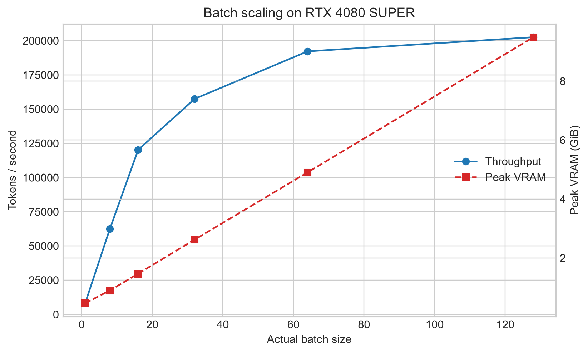

Throughput rises from 8.2K tokens/s at batch 1 to 202.6K at batch 128, while
peak VRAM rises from 0.46 to 9.49 GiB.

## RTX 6000D optimization extensions

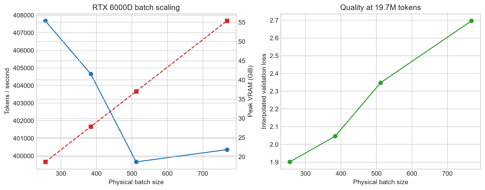

Batch 256 already saturates at about 408K tokens/s; increasing to 768 raises
peak VRAM from 18.67 to 55.38 GiB without increasing throughput.

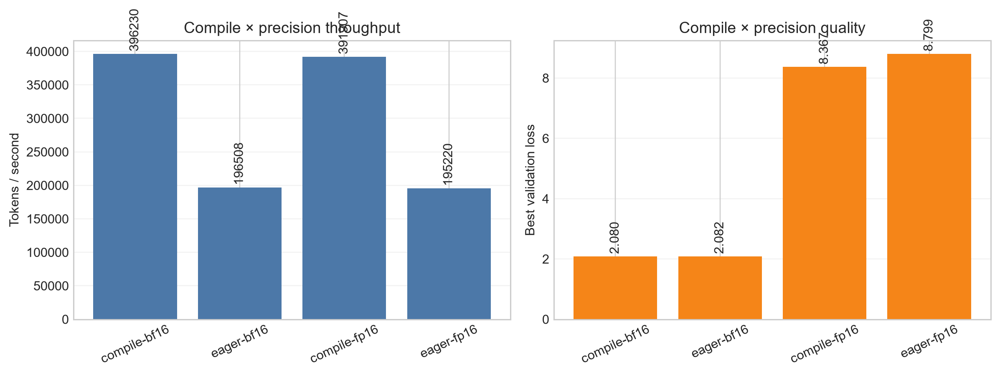

`torch.compile` doubles BF16 throughput (396K vs 197K tokens/s) and reduces
peak VRAM from 12.14 to 9.49 GiB. FP16 without `GradScaler` is fast but
numerically unstable, reaching only 8.37–8.80 validation loss.

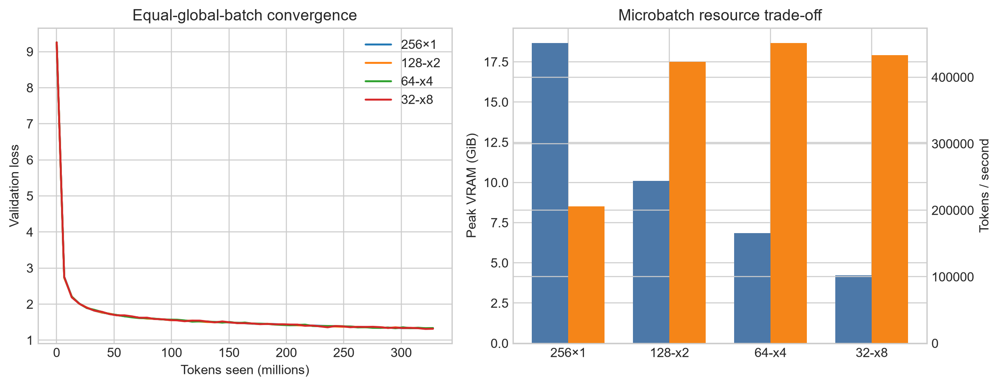

At global batch 256, physical batch 32 with eight accumulation steps reaches
1.311 validation loss using 4.22 GiB; physical batch 64×4 gives the highest
throughput at 451K tokens/s.

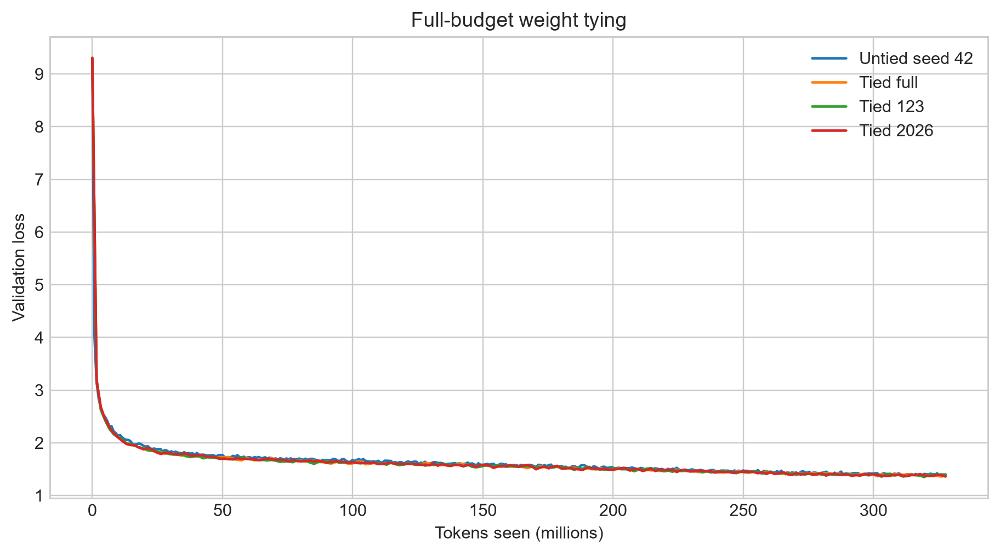

Full-budget tied embeddings reach **1.357 ± 0.005** across three seeds,
compared with **1.371 ± 0.002** for untied batch-32 runs, while removing
5.12M parameters.

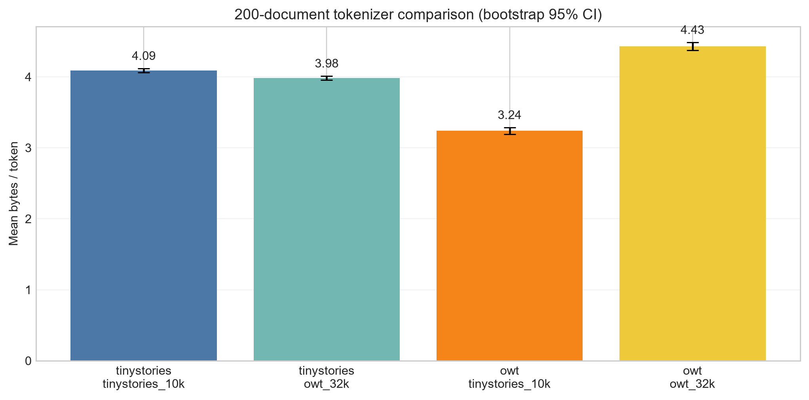

The cross-corpus tokenizer comparison was expanded from 10 to 200 documents
with bootstrap 95% confidence intervals.

## OpenWebText results

The 32K OWT tokenizer trains in 10,695 seconds with 46.45 GiB peak RSS and
compresses the full corpus to 4.371 bytes/token. On a deterministic
10-document OWT sample it reaches 4.461 bytes/token, versus 3.092 for the
TinyStories tokenizer.


The 40K-step OWT main run reaches best validation loss **4.116**. A
TinyStories-tokenizer OWT baseline reaches **3.081**, but token losses are not
directly comparable: normalized by compression, the 32K tokenizer improves
from 0.971 to 0.942 nats/byte.

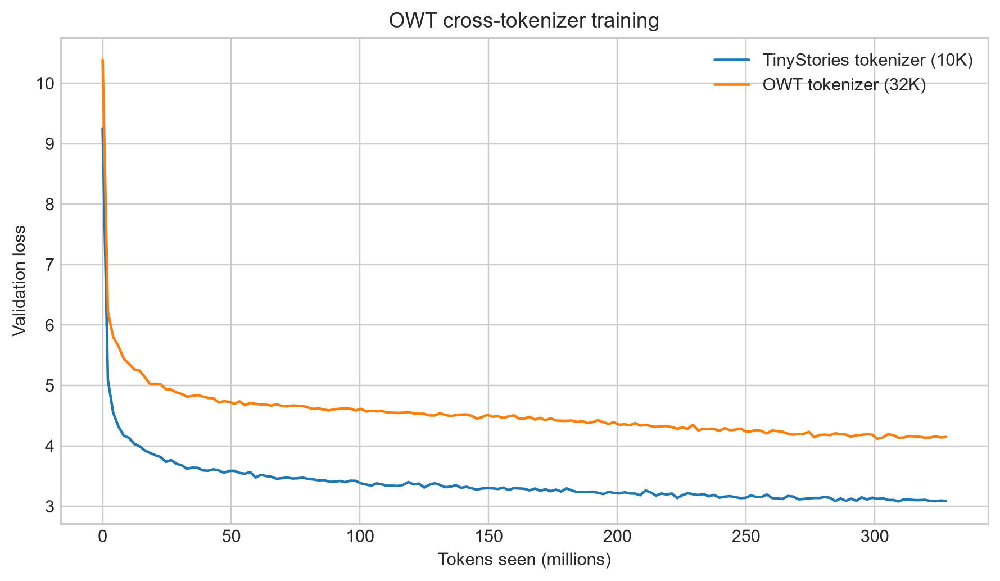

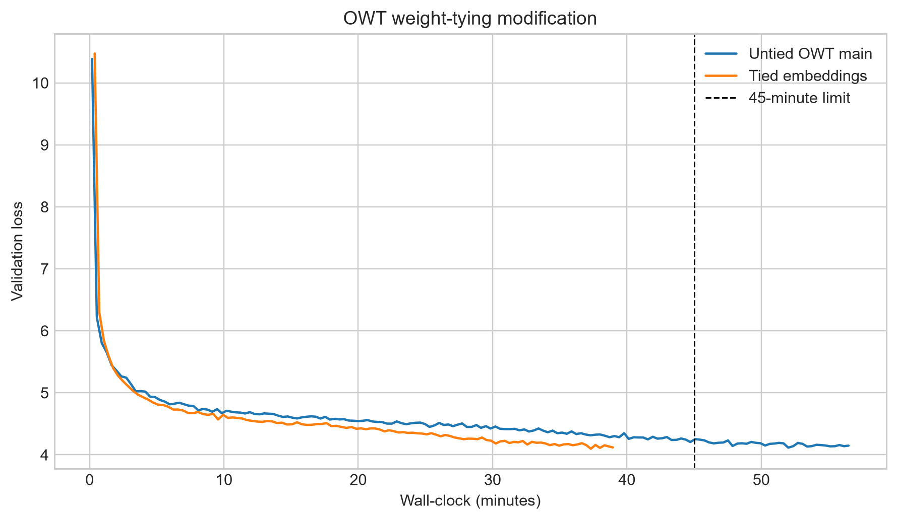

The optional tied-embedding modification runs for **38.96 minutes** on the
RTX 4080 SUPER and reaches **4.097** after 222.93M tokens. It reduces the
32K-vocabulary model from 45.22M to 28.84M parameters. This is a local proxy
experiment, not an official B200 leaderboard submission or ranking.

## Setup and reproduction

Install [`uv`](https://docs.astral.sh/uv/) and download TinyStories plus the
OpenWebText sample following the
[assignment handout](./cs336_assignment1_basics.pdf). Prepare tokenized data
before training:

```sh
uv sync
uv run python scripts/prepare_data.py \
  --train-text data/TinyStoriesV2-GPT4-train.txt \
  --valid-text data/TinyStoriesV2-GPT4-valid.txt \
  --output-dir data/tinystories --vocab-size 10000
uv run python scripts/train.py --config configs/tinystories-low-resource.json
uv run python scripts/build_report_assets.py \
  --raw report/results/raw --figures report/figures \
  --summary report/results/summary.json
cd report && make
```

Native Windows lacks the `resource` module used by two Linux-only tokenizer
memory tests; exact commands and provenance are in
[`VERIFICATION.md`](VERIFICATION.md).

## Use statement

This is a **non-course-submission** self-study record. All reported measurements
remain traceable to archived raw logs. Any local leaderboard proxy is clearly
distinguished from an official Stanford submission or ranking.
