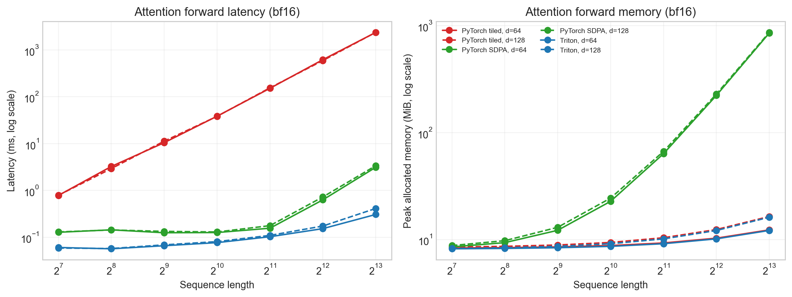
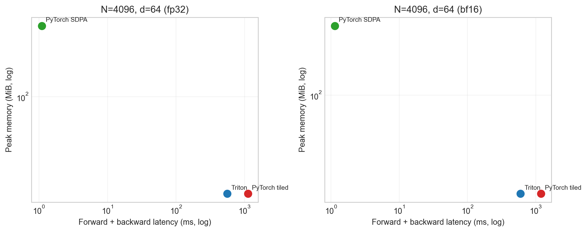
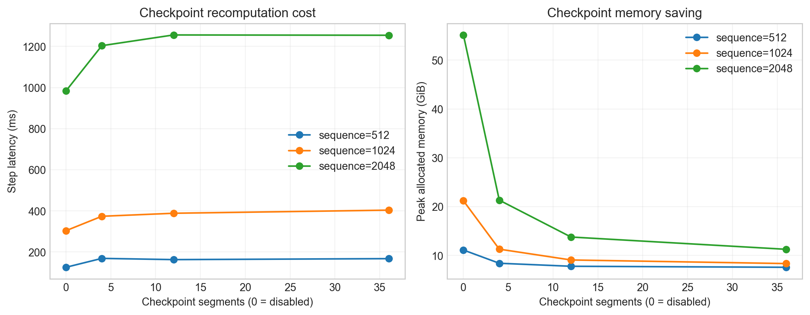
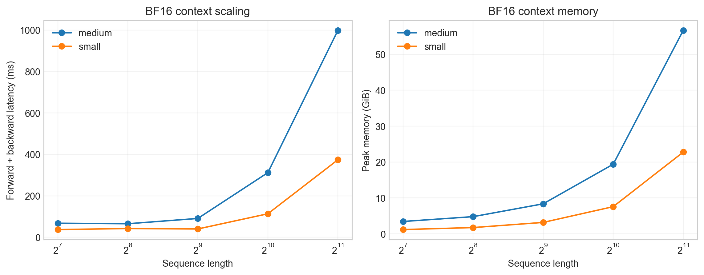
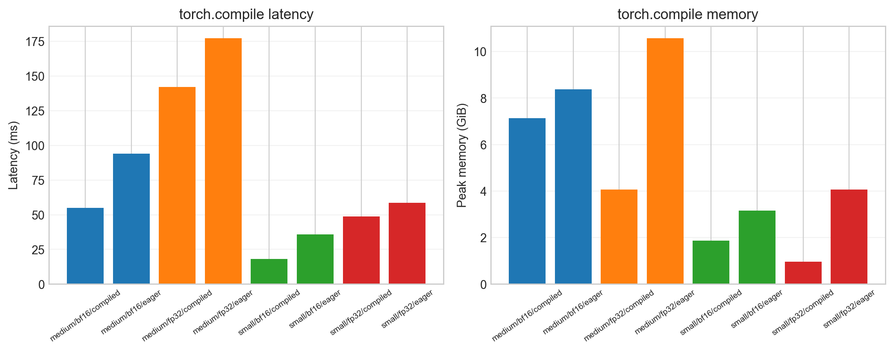

# CS336 Spring 2026 Assignment 2: Systems

这是 Assignment 2 的个人自学实现，覆盖 FlashAttention、Distributed Data
Parallel（DDP）、Optimizer State Sharding、Fully Sharded Data Parallel（FSDP）、
profiling 和可复现实验。官方题面见
[cs336_assignment2_systems.pdf](./cs336_assignment2_systems.pdf)。

> 本项目为 **非课程提交**的学习记录。作者：
> [ShaneLiu04](https://github.com/ShaneLiu04)。课程材料版权归原作者所有。

## 实现概览

- `cs336_systems/flash_attention.py`：PyTorch tiled online-softmax 与 Triton 路径；
- `cs336_systems/ddp.py`：per-parameter asynchronous all-reduce，与 backward 重叠；
- `cs336_systems/sharded_optimizer.py`：按 rank 分片 optimizer state；
- `cs336_systems/fsdp.py`：教学型 FSDP 接口、mixed precision 与完整参数重建；
- `tests/adapters.py`：官方测试到实现的薄适配层；
- `scripts/benchmark_systems.py`：统一 warmup、同步、OOM 记录和 CSV 元数据；
- `scripts/plot_results.py`：由原始 CSV 生成报告 PNG/PDF；
- `report/main.tex`：中文主体、保留英文术语的完整报告；
- `report/results/`：与 Assignment 1 一致的 raw/figures/tables、摘要与校验清单。

## 环境与测试

需要 Python 3.12/3.13；Triton 路径需要 Linux、CUDA 和 NVIDIA GPU。

```bash
uv sync
uv run pytest -v tests
uv run ruff check cs336_systems tests/adapters.py scripts
```

测试数据可确定性重建：

```bash
uv run python scripts/generate_test_fixtures.py
```

CPU/Gloo 测试验证多进程数学正确性；它不代表 NCCL 性能。单卡环境中应把
Triton correctness/performance 与 CPU distributed correctness 分开运行。

## 实验复现

远端一键入口不会保存任何密码或 token：

```bash
bash scripts/run_remote_experiments.sh
```

也可以单独运行 attention sweep：

```bash
uv run python scripts/benchmark_systems.py attention \
  --batch-size 1 \
  --sequence-lengths 128 256 512 1024 2048 4096 8192 \
  --head-dimensions 16 32 64 128 \
  --dtypes fp32 bf16
uv run python scripts/plot_results.py
```

原始记录写入 `report/results/raw/benchmark.csv`，每行包含硬件/软件版本、commit SHA、
配置、均值、标准差、peak memory 和 OOM/error 状态。图像不是手工填写，均由该 CSV
生成。

## 结果图

下图在对应指标存在时由脚本生成；详细实验设计、公式和局限见
[LaTeX 报告](report/main.tex)。













RTX 6000D 上的关键结果：

- xl forward+backward：BF16 438.12 ms，FP32 1120.75 ms（2.56× speedup）；
- xl peak allocated memory：BF16 38,058 MiB，FP32 40,990 MiB；
- `N=8192,d=64` 的 BF16 forward：Triton 0.307 ms，SDPA 3.122 ms（10.17×）；
- 同一 forward case 的 peak memory：12.16 MiB vs 853.13 MiB（70.2× reduction）；
- `N=8192,d=64` BF16 fused forward+backward：0.796 ms，SDPA 5.404 ms
  （6.79× speedup），peak memory 24.31 MiB vs 1051.25 MiB；
- `N=32768,d=64` BF16 fused forward+backward：10.06 ms vs SDPA 88.56 ms
  （8.80×），peak memory 48.5 MiB vs 16,444 MiB（339× reduction）；
- `N=4096,d=64` 的 FP32 attention：SDPA / PyTorch tiled / Triton 路径分别为
  1.10 / 1117.99 / 556.09 ms；
- 同一 attention case 的 peak memory：280.25 / 24.38 / 24.38 MiB。
- large、batch 2、sequence 2048 使用 36 个 checkpoint segments 后，peak memory
  从 56.48 GiB 降至 11.53 GiB，step latency 从 983.81 ms 增至 1254.51 ms。

旧 fallback 数据用于定位 Python tiled backward 瓶颈；新增 delta、dQ 与 dK/dV Triton
kernels 后，forward 的 IO 优势已经延伸到完整 backward。完整 228 条性能记录、
256 条数值误差记录、12 条 checkpointing 记录及环境元数据见
[`report/results/raw/benchmark.csv`](report/results/raw/benchmark.csv) 和
[`report/results/raw/remote_environment.txt`](report/results/raw/remote_environment.txt)。

课程题面要求的多卡 NCCL、2-GPU DDP/FSDP overlap 与 2×B200 Leaderboard
不能由单张 RTX 6000D 真实测量。报告会明确写为“未实测”，不会用 CPU/Gloo 或理论值
冒充多卡 GPU 结果。

## 报告编译

安装 TeX Live（含 XeLaTeX、`ctex` 和 `latexmk`）后：

```bash
cd report
make
```

输出为 `report/writeup.pdf`。提交打包仍可使用官方
`./test_and_make_submission.sh`，但自学仓库的主要交付物是实现、原始指标、生成图和报告。
