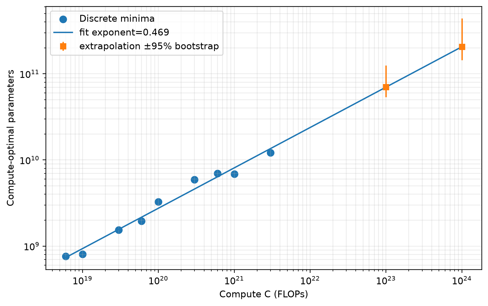
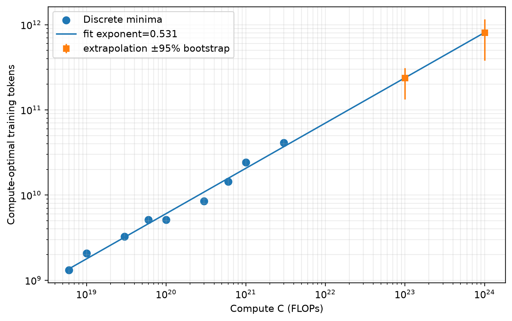

# CS336 Spring 2026 Assignment 3: Scaling

这是 Assignment 3 的 **非课程提交**自学实现，作者：
[ShaneLiu04](https://github.com/ShaneLiu04)。

本仓库实现官方 IsoFLOP 分析、bootstrap uncertainty、联合 scaling law，并使用
RTX 6000D 执行 TinyStories proxy scaling matrix。由于没有 Stanford A3 API key，
报告不会声称官方 B200 leaderboard 结果，也不会伪造 `/final_submission`。

## 自学产物

- `scripts/analyze_scaling.py`：官方 IsoFLOP 幂律、联合 law、残差与外推；
- `scripts/make_proxy_manifest.py`：生成 token-aligned proxy matrix；
- `report/results/`：raw、figures、tables、summary、experiment log、manifest；
- [`report/main.tex`](report/main.tex) 与 [`report/writeup.pdf`](report/writeup.pdf)：
  中文主体、保留英文术语的完整报告。





For a full description of the assignment, see the assignment handout at
[cs336_assignment3_scaling.pdf](./cs336_assignment3_scaling.pdf).

If you see any issues with the assignment handout or code, please feel free to
raise a GitHub issue or open a pull request with a fix.

## For students

Install uv

```sh
uv sync
```

Set `A3_API_KEY` to your 8-digit student ID:

```sh
export A3_API_KEY=06123456
```

The hosted training API is available at:

```text
http://hyperturing.stanford.edu:8000
```

Click here for the [docs](http://hyperturing.stanford.edu:8000/docs) and [dashboard](http://hyperturing.stanford.edu:8000/dashboard).

See [`./examples/client_example.ipynb`](./examples/client_example.ipynb) for an
example of submitting and inspecting training runs.

## For non-students

Install dependencies:

```sh
uv sync --extra server
```

To download tokenized data:

```sh
uv run modal run scripts/1_download_tokenized_data.py
```

To run training directly:

```sh
uv run cs336_scaling/training/run.py
```

To run the API and dispatcher, set:

```sh
DATABASE_URL_PROD="postgresql://..."
DATABASE_URL_DEV="postgresql://..."
INTERNAL_API_KEY="SOMEKEY"
```

Then run:

```sh
DB_ENV=prod uv run fastapi run &
DB_ENV=prod uv run dispatcher &
```
