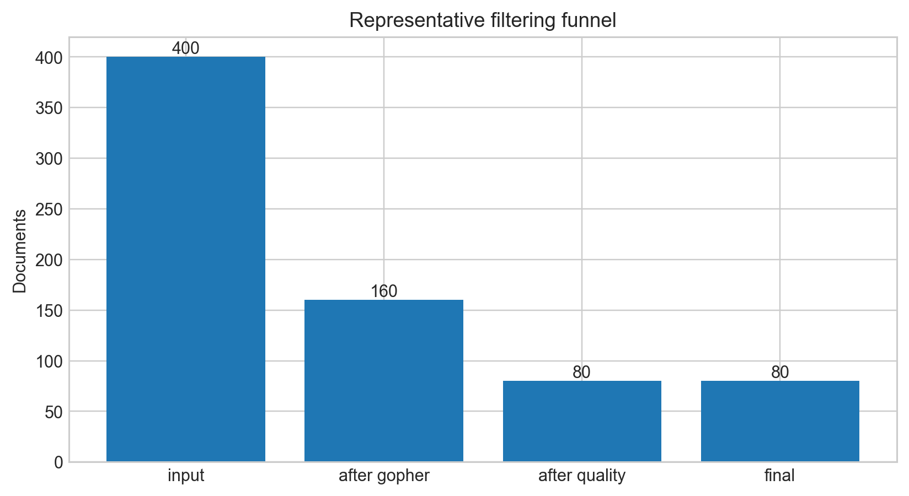
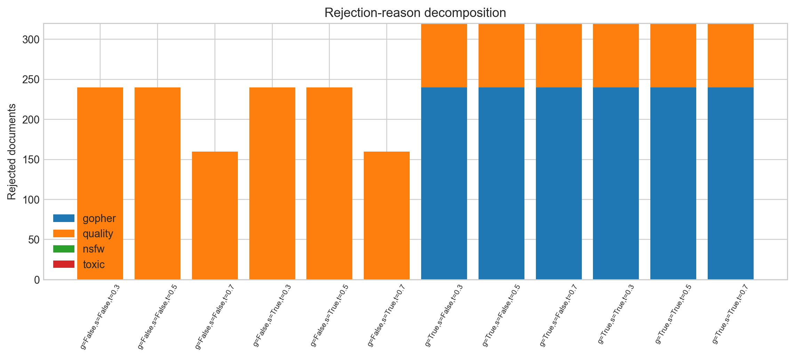
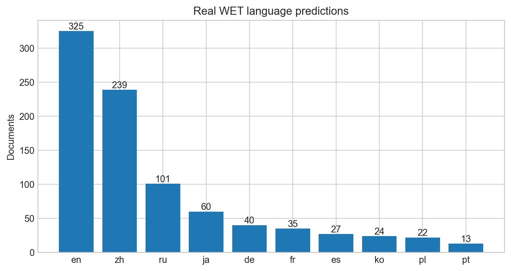

# CS336 Spring 2026 Assignment 4: Data

这是 Assignment 4 的 **非课程提交**自学实现，作者：
[ShaneLiu04](https://github.com/ShaneLiu04)。

已完成 HTML extraction、language ID、PII、NSFW/toxicity、Gopher quality、
quality classification、exact line 与 MinHash deduplication；公开测试 21/21 通过。
离线报告使用 400 篇受控文档、1000 条官方 sample WET records 和 12 组过滤消融。
由于没有 SUNET_ID/Modal 权限，
不声称 2500-WET 或 8×B200 leaderboard 成绩。

## 主要产物

- `cs336_data/`：模块化过滤、去重与 tokenization；
- `scripts/run_offline_experiments.py`：受控过滤消融；
- `scripts/build_report_assets.py`：15 组自动图表与 manifest；
- [`report/main.tex`](report/main.tex) / [`report/writeup.pdf`](report/writeup.pdf)：
  中文主体、保留英文术语的报告。









For a full description of the assignment, see the assignment handout at
[cs336_assignment4_data.pdf](./cs336_assignment4_data.pdf)

If you see any issues with the assignment handout or code, please feel free to
raise a GitHub issue or open a pull request with a fix.

## Setup

This directory is organized as follows:

- [`./cs336_basics`](./cs336_basics): This module contains the staff 
  implementation of the language model from assignment 1. You will use this training code
  to train an LM on your filtered data. You should not modify the training logic, since
  your leaderboard submission must use it exactly.
- [`./cs336_data`](./cs336_data): This folder is basically empty! This is the
  module where you will implement code to filter and process the data.

Visually, it should look something like:

``` sh
.
├── cs336_basics  # A python module named cs336_basics
│   └── ... an optimized training implementation ...
├── cs336_data  # TODO(you): code that you'll write for assignment 4
│   ├── __init__.py
│   └── ... TODO(you): any other files or folders you need for assignment 4 ...
├── README.md
├── pyproject.toml
└── ... TODO(you): other files or folders you need for assignment 4 ...
```

As in previous assignments, we use `uv` to manage dependencies.

## Downloading data

### For students

Data is available at `/shared-data`, such as `uv run modal shell ./scripts/download_data.py::main --cmd "ls -l /shared-data"`

To only download the files needed for running offline, run `uv run scripts/download_data.py --offline-only`.
To download all data for the students, run `uv run modal run scripts/download_data.py`

### For non-students

To only download the files needed for running offline, run `uv run scripts/download_data.py --offline-only`.

Implement the method `is_english` in [`./cs336_data/wet_files.py`](./cs336_data/wet_files.py) before downloading the full non-offline data.

#### Modal

Remove `environment_name` from `shared_data_volume` in [`./cs336_data/modal_utils.py`](./cs336_data/modal_utils.py)

```python
uv run modal run scripts/download_data.py
```

#### Non-modal

Change the path in [`./cs336_data/common.py`](./cs336_data/common.py) and run `uv run scripts/download_data.py`.

Consider changing `n_files` for `EnglishWetFiles` in [`./cs336_data/wet_files.py`](./cs336_data/wet_files.py) if you want to download less than 2.5k WET files.

## Training on Modal

The Modal entrypoint in [`./scripts/train.py`](./scripts/train.py) contains the full training config; pass the path to your GPT-2-tokenized training data with `--train-bin`.

The final training run uses 8 B200 GPUs:

```sh
uv run modal run scripts/train.py --train-bin /root/data/your_data.bin
```

## Submitting

To submit, run `./test_and_make_submission.sh` . This script will install your
code's dependencies, run tests, and create a zip with the output. We
should be able to unzip your submitted tarball and run
`./test_and_make_submission.sh` to verify your test results.
