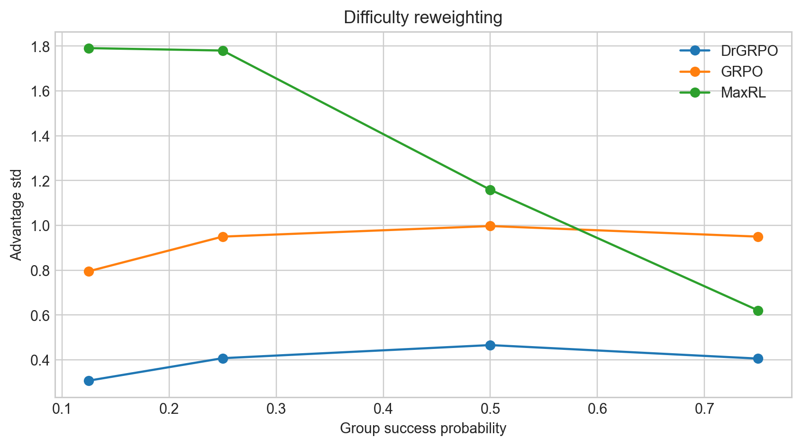
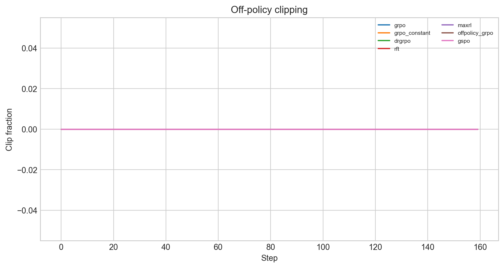

# CS336 Spring 2026 Assignment 5: Alignment

这是 Assignment 5 的 **非课程提交**自学实现，作者：
[ShaneLiu04](https://github.com/ShaneLiu04)。

已完成 GRPO/Dr.GRPO/MaxRL/RFT、off-policy GRPO/GSPO、SFT packing、
MMLU/GSM8K parsing 与 DPO loss；主作业和 supplement 共 26/26 tests 通过。
RTX 6000D proxy 覆盖 7 种 objectives、4 seeds、160 steps（4480 条指标）。
由于没有 SUNET_ID/Modal 权限，报告不声称官方 OLMo-2/B200 accuracy。

## 自学产物

- `cs336_alignment/grpo.py`：完整 on/off-policy objectives 与 train step；
- `cs336_alignment/supplement.py`：SFT packing、metrics、DPO；
- `scripts/run_proxy_alignment.py`：GPU vectorized objective study；
- [`report/writeup.pdf`](report/writeup.pdf)：中文 LaTeX 报告。






For a full description of the assignment, see the assignment handout at
[cs336_spring2026_assignment5_alignment.pdf](./cs336_spring2026_assignment5_alignment.pdf)

We will include a supplemental (and completely optional) assignment on safety alignment, instruction tuning, and RLHF at [cs336_spring2026_assignment5_supplement_safety_rlhf.pdf](./cs336_spring2026_assignment5_supplement_safety_rlhf.pdf)

If you see any issues with the assignment handout or code, please feel free to
raise a GitHub issue or open a pull request with a fix.

## Setup

As in previous assignments, we use `uv` to manage dependencies.

1. Install all packages except `flash-attn`, then all packages (`flash-attn` is weird)
```
uv sync --no-install-package flash-attn
uv sync
```

2. Run the required unit tests:

``` sh
uv run pytest tests/test_grpo.py
```

Initially, all tests should fail with `NotImplementedError`s.
To connect your implementation to the tests, complete the
functions in [./tests/adapters.py](./tests/adapters.py).
